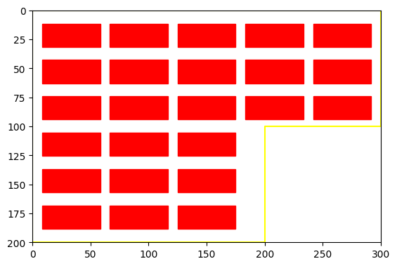
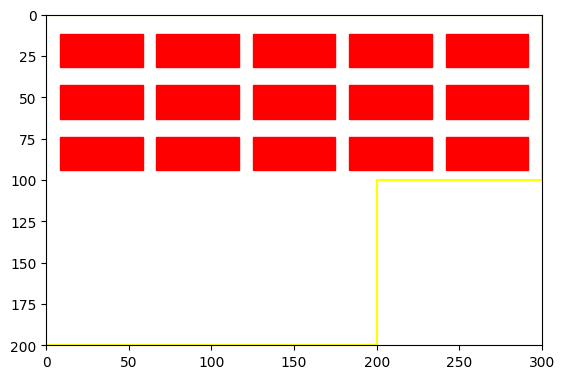
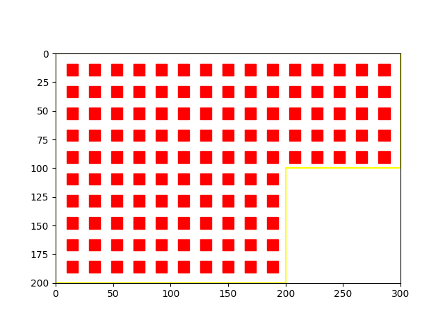
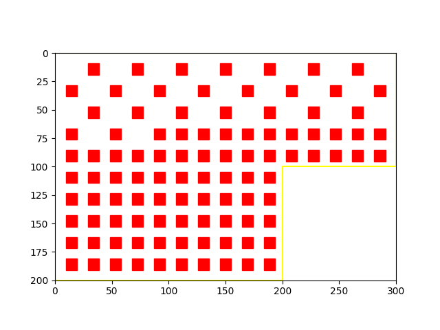
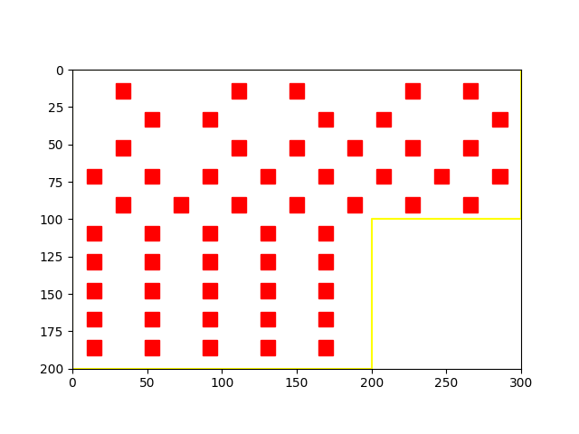
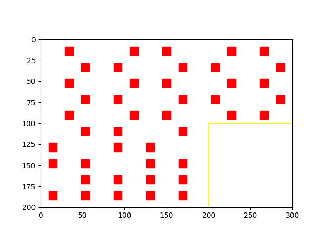
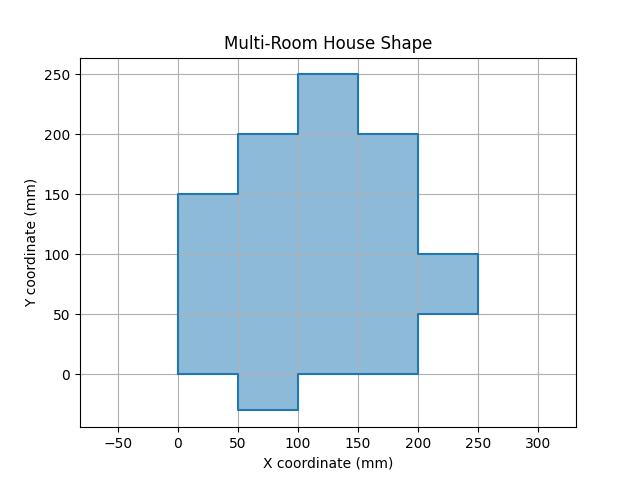
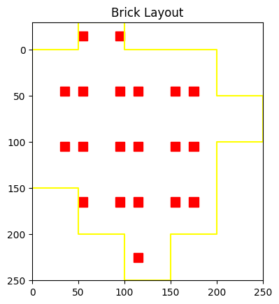
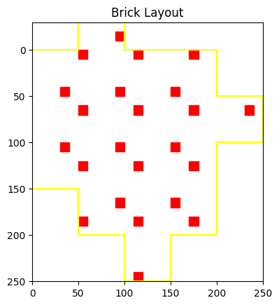

## Brick Algorithm

Case 1 :  Half / Area 

Case 2 : Distribute Arrange / Area

## Result 

Case 1 : 

Case 2 : 

- 50 %

- 20 %

- 10 %

- 5 %

## Pattern Case 

[sample](./docs/pattern/) 

## CopyRight

- Author : Chuong Ho

[GPL-3.0 License](./gnu-gpl-v3.0.md)
